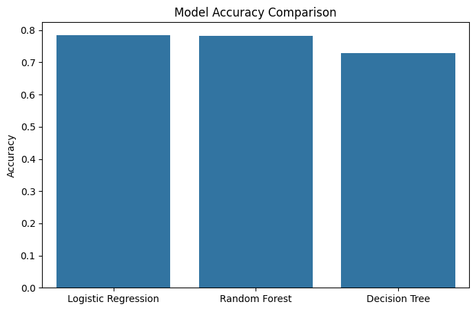
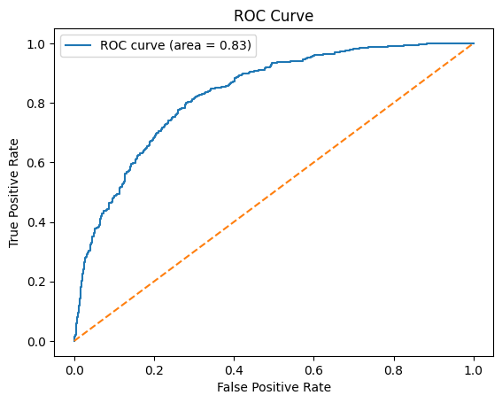
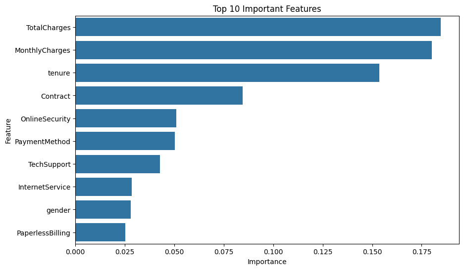

# Customer Churn Prediction

End-to-end machine learning pipeline for predicting customer churn using machine learning models.

## Models Used
- Logistic Regression
- Random Forest
- Decision Tree

Best accuracy: **~78%**

---

## Model Accuracy Comparison

---

## ROC Curve

---

## Feature Importance

---

## Key Insights

- Customers with higher monthly charges are more likely to churn  
- Customers with shorter tenure show higher churn risk  
- Contract type strongly affects customer retention  
- Service features such as OnlineSecurity and TechSupport also influence churn

---

## Tech Stack

Python  
Pandas  
Scikit-learn  
Matplotlib  
Seaborn
